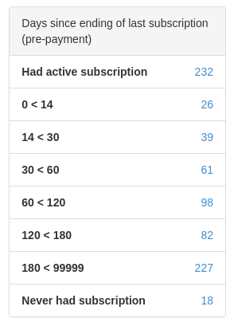
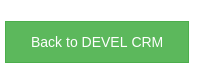

# CRM SalesFunnel Module

## Installing module

We recommend using Composer for installation and update management.

```shell
composer require remp/crm-salesfunnel-module
```

### Enabling module

Add installed extension to your `app/config/config.neon` file.

```neon
extensions:
	- Crm\SalesFunnelModule\DI\SalesFunnelModuleExtension
```

### Configuration

By default we register for every sales funnel short route _(e.g. for sales funnel with URL key `sample`, route is `http://crm.press/sample`)_. You can turn off registration of slug by adding following setting to configuration file.

```neon
sales_funnel:
	funnel_routes: false
```

Sales funnel will be still accessible through long route _(e.g. `http://crm.press/sales-funnel/sales-funnel-frontend/show?funnel=sample`)_.

### Scheduled commands

Please add following commands to your scheduler:

- `sales-funnel:distributions`. Every sales funnel precalculates data about users who paid through it in advance. These calculations are used to provide stats and distributions on the funnel detail. Stats are updated on the fly, but it's recommended to run this once a day. 

## Using sales funnels

Sales Funnel module provides a way to present subscription type offering to user in a way that's completely independent
from the rest of application.

You can find list of available sales funnels and create new funnels in CRM admin (`/sales-funnel/sales-funnels-admin/`).

To create new sales funnel, you need to enter several fields (required are bold):

* **Name**. Name of the sales funnel displayed in CRM admin listings and statistics.
* *Active*. Flag, whether the window should be available to users or not.
* **URL key**. Slug under which the window is available. All funnels are available at custom routes - e.g. sample funnel with url key `sample` would be available at `http://crm.press/sales-funnel/sales-funnel-frontend/show?funnel=sample` and at `http://crm.press/sample` _(if slugs are allowed, see [Configuration](#configuration))_.
* *Only logged*. Flag to limit access to only logged in users.
* *Only not logged*. Flag to limit access to only not logged in users.
* *Segment*. Segment selection to limit access only to members of a specific segment.
* *Valid from*. Date constraint allowing funnel to be available only after specified date.
* *Valid to*. Date constraint allowing funnel to be available only before specified date.
* **Funnel HTML content**. HTML content of funnel (top-bottom HTML needs to be provided; description below)
* *Funnel no access HTML*. HTML to display to user if she doesn't have an access to window due to specified constraints.
If no HTML is provided, default [`funnel-no-access`](http://crm.press:8080/admin/snippets-admin/) is displayed
* *Funnel error screen HTML*. HTML to display if there's any kind of validation error with funnel.
If no HTML is provided, default [`funnel-error`](http://crm.press:8080/admin/snippets-admin/) is displayed

Once the funnel is created, there are more options that can be configured within the detail of created funnel:

* *Subscription types*. Every funnel has list of whitelisted subscription types. Array of allowed subscription types
is provided to HTML content template as a twig variable for further usage. Only whitelisted subscription types will
be allowed to be submitted within funnel, otherwise the validation will return an error.
    
* *Payment gateways*. Every funnel has a list of whitelisted payment gateways. Array of allowed gateways is provided
to HTML content template as a twig variable for further usage. Only whitelisted gateways will be allowed to be
submitted within funnel, otherwise the validation will return an error. 

The HTML content of funnel can be anything from very simple HTML form to micro JS application calling backend APIs
and routing user through multi-step experience. Funnels support [Twig](https://twig.symfony.com) templating and provide
variables to be used within the template:

* `funnel`: Instance of `sales_funnels` table row (as an `Nette\DB\Table\ActiveRow` implementation)
* `isLogged`: Flag, whether the user is logged in or not. Should be utilized to display login form.
* `gateways`: Array of `gateways` table rows. Should be utilized to show/hide whitelisted gateways in combination
with Twig's `if` statements:
   
    ```twig
    
      <div class="row"><!-- gateway input --></div>
    
    ```
    
* `subscriptionTypes`: Array of `subscription_types` table rows. Should be utilized to show/hide whitelisted subscription
types in combination with Twig's `if` statements:

    ```twig
    
      <div class="row"><!-- subscription type input --></div>
    
    ```

* `addresses`: Array with all stored user's addresses
* `meta`: Sales funnel metadata seeded into the `sales_funnel_meta` table
* `jsDomain`: Javascript domain to be used if working with cookies
* `actualUserSubscription`: Reference to actual user's subscription - row of `subscriptions` table as an
`Nette\DB\Table\ActiveRow` implementation.
* `referer`: Referer parameter used to access the sales funnel. Loaded primarily from `referer` query string parameter.
If not provided, HTTP referer is used instead.
* `values`: Array of values submitted before if the page is reloaded.
* `errors`: Array of errors generated on last submit.

You can use/ignore any of these variables. They're provided to give your template information about user for you
to decide what user should see.

The final output of sales funnel should be POST request to `/sales-funnel/sales-funnel-frontend/submit`-  either via
HTML form or via AJAX request. The POST params should contain:

* `funnel_url_key`: URL key of funnel defined when creating sales funnel. Can be populated from `{{ funnel.url_key }}`
variable.
* `auth`: Flag `0` / `1` whether CRM should attempt to authenticate user with email and password.
* `email`: If authenticating, user should provide his email.
* `password`: If authenticating, user should provide his password.
* `subscription_type`: Code of subscription type (not ID) that user selected to purchase.
* `payment_gateway`: Code of payment gateway user selected to pay through.
* `additional_amount`: Additional amount of money that should be included within the payment on top of standard
subscription type price. Used for donations.
* `additional_type`: Flag, whether the `additional_amount` should be included in the future charges if the payment
is made via recurrent gateway. Allowed values are `single` / `recurrent`.
* `address_id`: If user was offered an address in sales funnel, you can submit ID of address that will be stored
within the payment and later in created subscription. Useful if you want to enforce delivery address to be
non-standard.
* `custom`: Key-value pairs (i.e. `custom[key]=value`) which will be stored as text in payment's note field.
* `allow_redirect`: Flag specifying whether the response should contain redirect headers or just JSON response
with URL of payment gateway. Useful if you don't want to redirect user away from CRM, but only submit values via AJAX
and display payment gateway within iframe of a modal window. 

If the form is valid, backend will create new unfinished payment for the user and the server response will contain
redirection to payment gateway.

### Sample funnel

Module provides seeder with single demo funnel which contain very barebone bootstrap-based design and simple javascript
handler to ask and validate user's email/password.

When the module is enabled, you can seed this funnel by running `php bin/command.php application:seed` and it will get
available at `/sample` URL on your domain. You can (and should) also find your funnel in CRM admin
(`/sales-funnel/sales-funnels-admin/)`as you still need to enable subscription types and gateways for this newly seeded
funnel to work correctly.

If you want to only view the sample implementation of funnel, you can [find it here](./src/seeders/sales_funnels/sample.twig).

## Events and handlers

### PaymentItemContainerReadyEvent

This event is emitted from `SalesFunnelFrontedPresenter::renderSubmit` after `PaymentItemContainer` was initialized and filled with base payment items _(eg `SubscriptionTypePaymentItem`)_ but before payment is created.

All handlers which register listener for this event have access to whole `PaymentItemContainer`. It can be used to add payment items before payment is created and before customer is redirected to payment provider.

#### ExampleModule implementation

For example - your sales funnel contains specific donation input field with name `specific_donation` and you want to add it to the payment.

Create handler `Crm\ExampleModule\Events\PaymentItemContainerReadyEventHandler`:

```php
<?php

namespace Crm\ExampleModule\Events;

use Crm\PaymentsModule\PaymentItem\DonationPaymentItem;
use League\Event\AbstractListener;
use League\Event\EventInterface;

class PaymentItemContainerReadyEventHandler extends AbstractListener
{
    public function handle(EventInterface $event)
    {
        $paymentData = $event->getPaymentData();
        if (isset($paymentData['specific_donation']))
        {
            $paymentItemContainer = $event->getPaymentItemContainer();
            $paymentItemContainer->addItem(
                new DonationPaymentItem(
                    $name = 'Specific donation',
                    $price = $paymentData['specific_donation'],
                    $vat = 0
                )
            );
        }
    }
}
```

And initialize listener in `ExampleModule\ExampleModule.php`

  ```php
    public function registerEventHandlers(\League\Event\Emitter $emitter)
  {
    //...
    $emitter->addListener(
      \Crm\SalesFunnelModule\Events\PaymentItemContainerReadyEvent::class,
      $this->getInstance(\Crm\ExampleModule\Events\PaymentItemContainerReadyEventHandler::class)
    );
    //...
  ```

Newly created payment by SalesFunnel will now contain specific donation if sales funnel received this field.

## Components

**AmountDistributionWidget**

Admin sales funnel detail distribution stats component.


[Source code](https://github.com/remp2020/crm-salesfunnel-module/blob/23fdf1103d5c37f9ffe1f941cbb6025194d16720/src/components/AmountDistributionWidget/AmountDistributionWidget.php#L1)

[How to use](https://github.com/remp2020/crm-salesfunnel-module/blob/23fdf1103d5c37f9ffe1f941cbb6025194d16720/src/presenters/DistributionAdminPresenter.php#L33)

**DaysFromLastSubscriptionDistributionWidget**

Admin sales funnel detail distribution stats component.



[Source code](https://github.com/remp2020/crm-salesfunnel-module/blob/23fdf1103d5c37f9ffe1f941cbb6025194d16720/src/components/DaysFromLastSubscriptionDistributionWidget/DaysFromLastSubscriptionDistributionWidget.php#L1)

[How to use](https://github.com/remp2020/crm-salesfunnel-module/blob/23fdf1103d5c37f9ffe1f941cbb6025194d16720/src/presenters/DistributionAdminPresenter.php#L65)

**FinishRegistrationWidget**

Frontend successful payment/registration widget.



[Source code](https://github.com/remp2020/crm-salesfunnel-module/blob/23fdf1103d5c37f9ffe1f941cbb6025194d16720/src/components/FinishRegistrationWidget/FinishRegistrationWidget.php#L1)

[How to use](https://github.com/remp2020/crm-salesfunnel-module/blob/23fdf1103d5c37f9ffe1f941cbb6025194d16720/src/SalesFunnelModule.php#L134)

**NewSubscriptionWidget**

Frontend new subscription widget with iframe containing sales funnel.

[Source code](https://github.com/remp2020/crm-salesfunnel-module/blob/23fdf1103d5c37f9ffe1f941cbb6025194d16720/src/components/NewSubscriptionWidget/NewSubscriptionWidget.php#L1)

[How to use](https://github.com/remp2020/crm-salesfunnel-module/blob/23fdf1103d5c37f9ffe1f941cbb6025194d16720/src/SalesFunnelModule.php#L123)

**PaymentDistributionWidget**

Admin sales funnel detail stats widget.


[Source code](https://github.com/remp2020/crm-salesfunnel-module/blob/23fdf1103d5c37f9ffe1f941cbb6025194d16720/src/components/PaymentDistributionWidget/PaymentDistributionWidget.php#L1)

[How to use](https://github.com/remp2020/crm-salesfunnel-module/blob/23fdf1103d5c37f9ffe1f941cbb6025194d16720/src/presenters/DistributionAdminPresenter.php#L49)

**SalesFunnelUserListingWidget**

Admin user listing widget.


[Source code](https://github.com/remp2020/crm-salesfunnel-module/blob/23fdf1103d5c37f9ffe1f941cbb6025194d16720/src/components/SalesFunnelUserListingWidget/SalesFunnelUserListingWidget.php#L1)

[How to use](https://github.com/remp2020/crm-salesfunnel-module/blob/23fdf1103d5c37f9ffe1f941cbb6025194d16720/src/SalesFunnelModule.php#L152)

**SubscriptionTypesInSalesFunnelsWidget**

Admin sales funnel detail subscription types listing.


[Source code](https://github.com/remp2020/crm-salesfunnel-module/blob/23fdf1103d5c37f9ffe1f941cbb6025194d16720/src/components/SubscriptionTypesInSalesFunnelsWidget/SubscriptionTypesInSalesFunnelsWidget.php#L1)

[How to use](https://github.com/remp2020/crm-salesfunnel-module/blob/23fdf1103d5c37f9ffe1f941cbb6025194d16720/src/SalesFunnelModule.php#L128)

**WindowPreview**

Admin sales funnel detail preview. 

[Source code](https://github.com/remp2020/crm-salesfunnel-module/blob/23fdf1103d5c37f9ffe1f941cbb6025194d16720/src/components/WindowPreview/WindowPreview.php#L1)

[How to use](https://github.com/remp2020/crm-salesfunnel-module/blob/23fdf1103d5c37f9ffe1f941cbb6025194d16720/src/presenters/SalesFunnelsAdminPresenter.php#L373)
